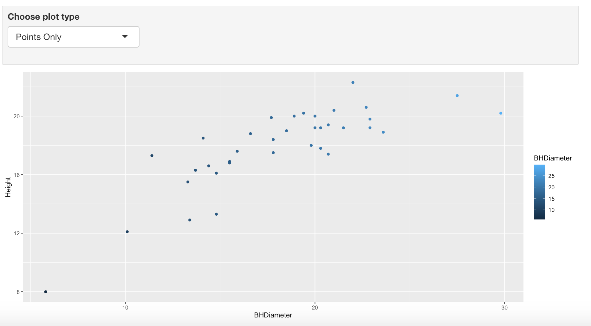
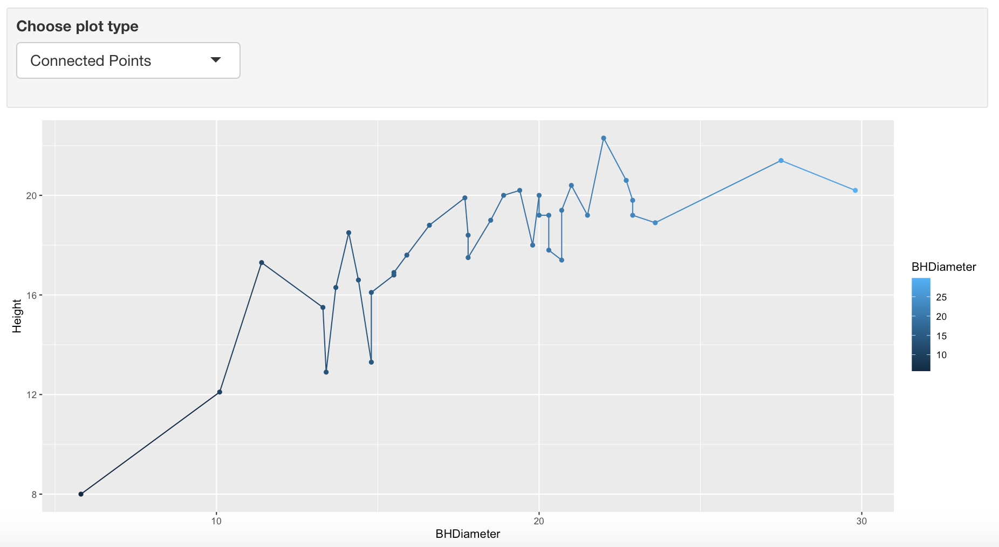
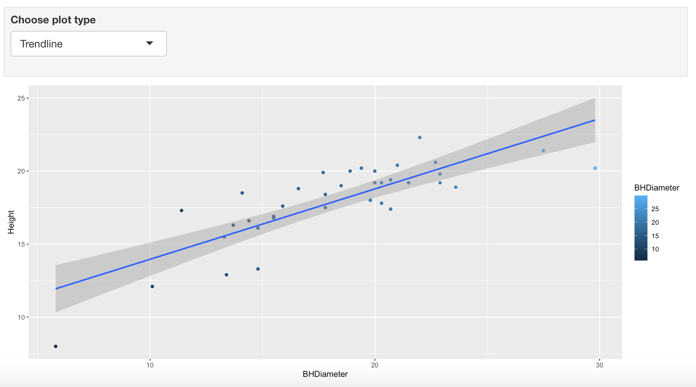

```{r setup, include=FALSE}
knitr::opts_chunk$set(echo = TRUE)
library(ggplot2)
```

# Task 1

```{r}
getwd()
```


# Task 2

```{r}
spruce.df = read.csv("SPRUCE.csv")
head(spruce.df)
```


# Task 3

```{r, align='center'}
plot(Height~BHDiameter, bg="Blue", pch=21, cex=1.2, ylim=c(0, 1.1* max(Height)), xlim=c(0, 1.1* max(BHDiameter)), main="Relationship between Height and Breast Height Diameter", ylab="Height (m)", xlab="Breast Height Diameter (cm)", data=spruce.df)
```
  
  b.    The relationship appears to trend along an slightly curved (exponential) line with the curve beginning and slowly turning downwards around the Breast Height Diameter = 15 mark along the x-axis.
  
```{r,align='center'}
library(s20x)

layout(matrix(1:4,nr=2,nc=2,byrow=TRUE))

trendscatter(Height~BHDiameter,f=0.5, data=spruce.df)
trendscatter(Height~BHDiameter,f=0.6, data=spruce.df)
trendscatter(Height~BHDiameter,f=0.7, data=spruce.df)

```
```{r, align='center'}
spruce.lm=with(spruce.df, lm(Height~BHDiameter))

summary(spruce.lm)

plot(Height~BHDiameter, bg="Blue", pch=21, cex=1.2, ylim=c(0, 1.1* max(Height)), xlim=c(0, 1.1* max(BHDiameter)), main="Relationship between Height and Breast Height Diameter", ylab="Height (m)", xlab="Breast Height Diameter (cm)", data=spruce.df)
abline(spruce.lm)
```
  
  
  c.    A straight line is not appropriate for these data points. The beginning outliers are not taken into account on this trend line, and the data is much more spread out below it than above. The smoother curve shows how a curved line would better fit this dataset.
  

# Task 4

```{r}
layout(matrix(1:4,nr=2,nc=2,byrow=TRUE))

#Plot 1 (1,1) 
plot(Height~BHDiameter, bg="Blue", pch=21, cex=1.2, ylim=c(0, 1.1* max(Height)), xlim=c(0, 1.1* max(BHDiameter)), main="Relationship b/t Height and BHD", ylab="Height (m)", xlab="Breast Height Diameter (cm)", data=spruce.df)
abline(spruce.lm)

#Plot 2 (1,2)
plot(Height~BHDiameter, bg="Blue", pch=21, cex=1.2, ylim=c(0, 1.1* max(Height)), xlim=c(0, 1.1* max(BHDiameter)), main="Relationship b/t Height and BHD", ylab="Height (m)", xlab="Breast Height Diameter (cm)", data=spruce.df)
with(spruce.df, {segments(BHDiameter, Height, BHDiameter, fitted(spruce.lm))})
abline(spruce.lm)

#Plot 3 (2,1)
plot(Height~BHDiameter, bg="Blue", pch=21, cex=1.2, ylim=c(0, 1.1* max(Height)), xlim=c(0, 1.1* max(BHDiameter)), main="Relationship b/t Height and BHD", ylab="Height (m)", xlab="Breast Height Diameter (cm)", data=spruce.df)
with(spruce.df, abline(h=mean(Height)))
abline(spruce.lm)
with(spruce.df, segments(BHDiameter,mean(Height),BHDiameter,fitted(spruce.lm),col="Red"))

#Plot 4 (2,2)
plot(Height~BHDiameter, bg="Blue", pch=21, cex=1.2, ylim=c(0, 1.1* max(Height)), xlim=c(0, 1.1* max(BHDiameter)), main="Relationship b/t Height and BHD", ylab="Height (m)", xlab="Breast Height Diameter (cm)", data=spruce.df)
with(spruce.df,abline(h=mean(Height)))
with(spruce.df, segments(BHDiameter,Height,BHDiameter,mean(Height),col="Green"))
```

TSS:
```{r}
TSS=with(spruce.df,sum((Height-mean(Height))^2))
TSS
```
MSS:
```{r}
ft=fitted(spruce.lm)
MSS=with(spruce.df,sum((ft-mean(Height))^2))
MSS
```
RSS:
```{r}
RSS=with(spruce.df,sum((Height-ft)^2))
RSS
```

$$\frac{MSS}{TSS}$$
```{r}
MSS/TSS
```

MSS+RSS
```{r}
MSS + RSS
```

TSS
```{r}
TSS
```


**Yes, MSS + RSS = TSS**   


# Task 5


```{r}
summary(spruce.lm)
```

  a.    The Slope is **.048147**
  b.    The Intercept is **9.14684**
  c.    Line Equation: $$y = .048147x + 9.14684$$
  d.    
```{r}
predict(spruce.lm, data.frame(BHDiameter=c(15, 18, 20)))
```
  
# Task 6

```{r, align='center', fig.width=12}
ggplot(spruce.df, aes(x=BHDiameter, y=Height, color=BHDiameter)) + geom_point() + geom_line() + geom_smooth(method=lm, formula = "y~x") + ggtitle("Height vs BHDiameter") + theme(plot.title = element_text(hjust = 0.5))
```

# Task 7
<center>
{ width=70% }
{ width=70% }
{ width=70% }
</center>